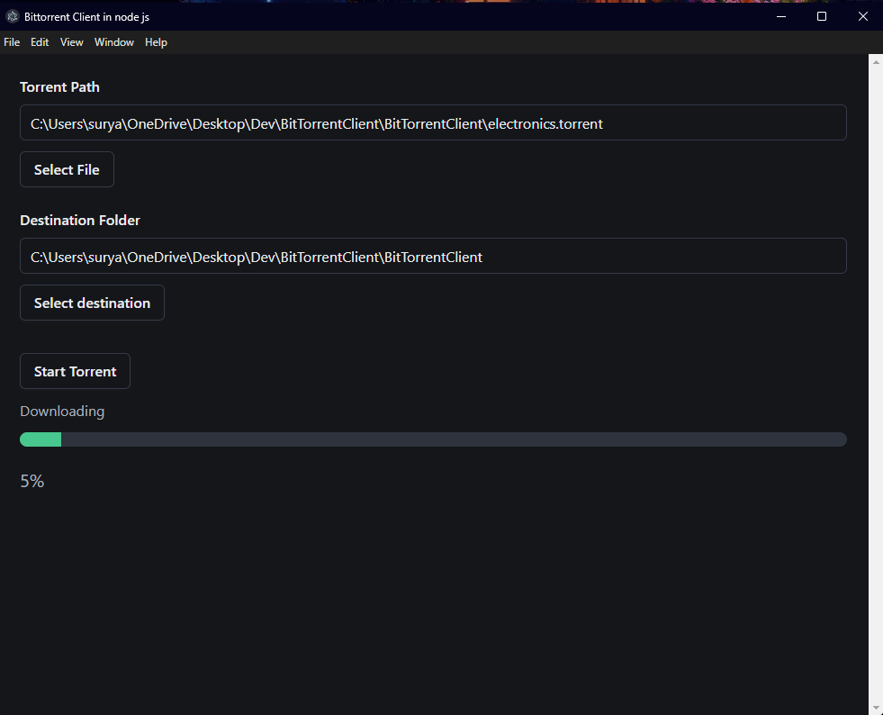

## Description

This is a BitTorrent client made in Node.js



## Current Features

- **Can download multiple file torrents** 
- **With Proper File Structure**
- **Checks all trackers sequentially**
- **UI Interface made with electron.js**

## Future Features

- **Better speeds using better algorithms**

## Prerequisites

- Node.js installed on your system
- For windows - need to have visual studio commmunity with Desktop development with C++

## Installation

1. Clone the repo:

   ```bash
   git clone https://github.com/x20surya/BitTorrentClient.git

2. Navigate to the project directory

3. Install dependencies:

    ```bash
    npm install

## How to Use

- Run the BitTorrent client with the following command:
  
    ```bash
    npm run start

## How to Build

- Build with the following command:

    ```bash
    npm run make

## Acknowledgments
Inspired by the blog post by Allen Kim: ["How to Make Your Own BitTorrent Client"](https://allenkim67.github.io/programming/2016/05/04/how-to-make-your-own-bittorrent-client.html)
